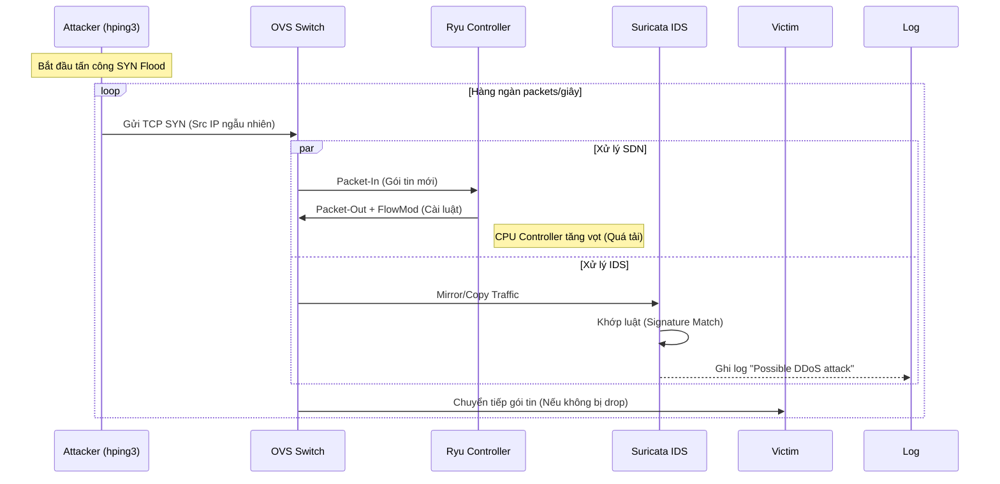

# UIT Project - NT541 - IDS on Software-Defined Network
## System Architecture:

## IP Addresses:
| Tên máy | Interface | Địa chỉ IP |
| :--- | :--- | :--- |
| Switch VM | VMNet 2, VMNet 1 | VMNet 2: 192.168.111.10/24   VMNet 1: 192.168.184.10/24 |
| Management VM | VMNet 2 | VMNet 2: 192.168.111.11/24 |
| Controller VM | VMNet 2 | VMNet 2: 192.168.111.12/24 |
| Victim VM | VMNet 2 | VMNet 2: 192.168.111.13/24 |
| Attacker | VMNet 1 | 192.168.184.11 |
## Notes for this project: [Note](NOTES.md)
## Workflow
### DDoS Attack

## Result:
- Created a SDN Architecture with OVSSwitch and Ryu Controller

- Monitoring System with Prometheus, Grafana, Loki

- Successfully detected DDoS attack with Suricata
